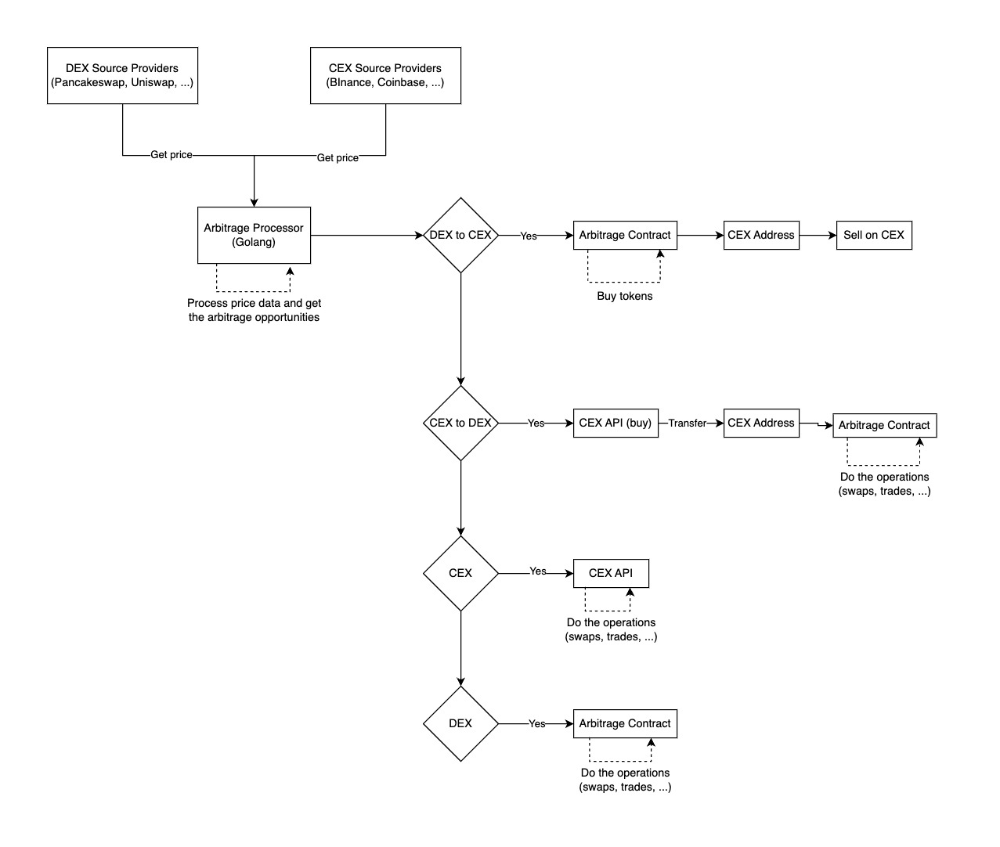

## Architecture

**SourceProvider** (format and deliver the same output):

- BinanceSourceProvider
- OKXSourceProvider
- UniswapSourceProvider

**ArbitrageProcessor** (calculate the arbitrage opportunity from input sources)

- Bellman-Ford algorithm
- TBD...

_Notes:_

- Should process all opportunities concurrently (gonum)

## Questions

- What is the role of contract in this circumstance like this [one](https://etherscan.io/address/0x507888e987257a8dde6f8afa46375cefe2cbf504)?

## Notes

- Infura account is available (free)
- 1inch swap -> price aggregator
